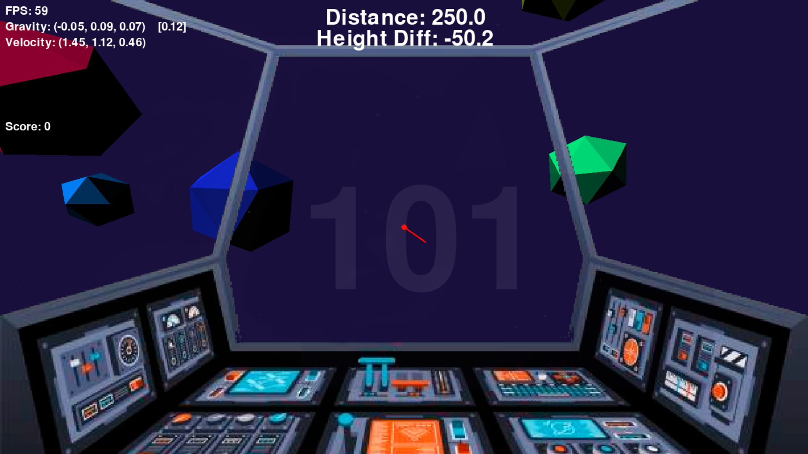

# PyWeek 36

Topic: **Dark Matter**

Idea: In a 3D space (for 3D pygame, I used my own repo [pygame3D](https://github.com/Hakkush-07/pygame-3D)) full of planets, the player travels with a spaceship. There exists unpredictable gravity due to dark matter! Can you reach your destination in time?

## Controls

- **ESC** -> quits
- **U** -> toggles free/game mode

### In Game Mode
- **WASD** -> applies force
- **TG** -> applies force up or down
- **NM** -> rotates left or right
- **X** -> detects the target planet in front of the player

### In Free Mode
- **WASD** -> changes position
- **TG** -> changes position up or down
- **MOUSE** -> rotates
- **O** -> resets camera rotation in case it is messed up
